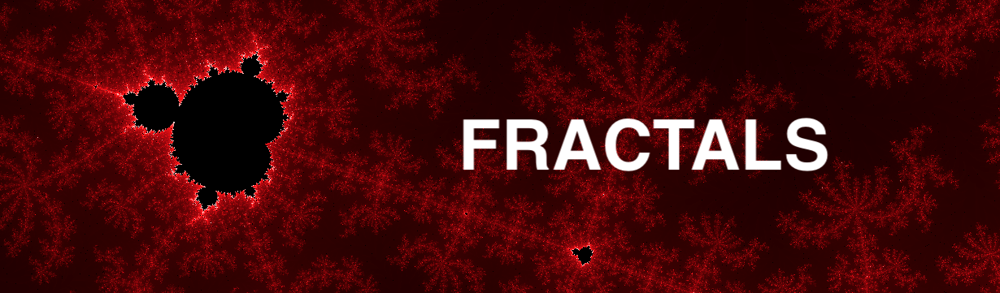

*A Vanilla JavaScript Fractal Visualizer*

## **Description**

Fractals are visual expressions of a repeating pattern or formula that gets progressively more complex.  
The goal of this project is to build an interface that allows to generate and interact with different fractal patterns.  

<ins> Implemented: </ins>
* Mandelbrot Set
* Binary Fractal Tree

<ins> To do: </ins>
* Julia Set

## **Technologies**

* Vanilla JavaScript DOM Manipulation (ES6)
* Webpack
* HTML5
* CSS

## **Highlights**

### Mandelbrot Set Visualizer

Iterative process: 
Performance: 

### Area Selection Zoom

### Asynchronous Progress Bar

### Interactive Binary Tree

