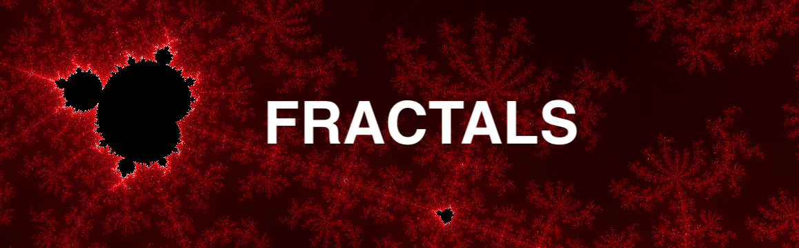

_A Vanilla JavaScript Fractal Visualizer_

## **Description**

Fractals are visual expressions of a repeating pattern or formula that gets progressively more complex. <br>
The goal of this project is to build an interface that allows to generate and interact with different fractal patterns. <br>

<ins> Implemented: </ins>

- Mandelbrot Set
- Binary Fractal Tree

<ins> To do: </ins>

- Julia Set

## **Technologies**

- Vanilla JavaScript DOM Manipulation (ES6)
- Canvas
- Webpack
- HTML5
- CSS

## **Highlights**


```html
<div>
  <canvas id="progress-bar"></canvas>
  <canvas id="selection-box"></canvas>
  <canvas id="main-canvas">Your browser doesn't support this content</canvas>
</div>
```

The Mandelbrot set visualizer works with 3 main objects, each with their own canvas elements. <br>

### Mandelbrot Set Visualizer

The visual representation of the Mandelbrot set is obtained by iterating over every pixel on screen and using it's coordinates in the Mandelbrot equation. The result of this equation as is a complex number that either remains low (< 4), or eventually tends to infinity. For each pixel the equation is repeatedly called hundreds or thousands of times depending on zoom level, to determine whether or not that pixel is in the set. The more interesting colors and patterns are found at the outskirts of the set, where a larger number of iterations are needed
[(more info)](https://en.wikipedia.org/wiki/Mandelbrot_set#History).

```js
// Convert the number of iterations it took to find a single pixel's color
// into a percentage of total iterations.
calcDepth(x0, y0) {
  let x = x0;
  let y = y0;
  for (let i = 0; i < this.depth; i++) {
    // Use pixel coordinates in Mandelbrot equation
    const x1 = x ** 2 - y ** 2 + x0;
    const y1 = 2.0 * x * y + y0;
    x = x1;
    y = y1;
    if (x * y > 4) {
      // Pixel is not part of the set and we return the number of iterations
      // it took to find out, as a percentage.
      return (i / this.depth) * 100;
    }
  }
  // If after the specified number of iterations the complex coordinates are
  // still within range, the pixel is part of the set and colored black.
  return 0;
}
```

### Area Selection Zoom

The selection rectangle handles:

- the rendering of the user's click and drag selection box
- validating the coordinates
- calling the update() method for the active Mandelbrot instance, using newly obtained coordinates

```js
// excerpt from "mandelbrot_controls.js"
class MandelbrotControls {
  constructor(mandelbrot) {
    this.selectRect.addEventListener("mousedown", (e) => this.selectStart(e));
    this.selectRect.addEventListener("mousemove", (e) => this.selectMove(e));
    this.selectRect.addEventListener("mouseup", (e) => this.selectEnd(e));
  }

  selectStart(e) {
    // extract x1 and y1 position on mousedown
    this.active = true;
    this.x1 = e.offsetX;
    this.y1 = e.offsetY;
  }

  selectMove(e) {
    if (this.active) {
      // draw a floating rectangle to represent user selection
      this.x2 = e.offsetX;
      this.y2 = e.offsetY;
      this.selectRender();
    }
  }

  selectRender() {
    if (this.active) {
      let left = Math.min(this.x1, this.x2);
      let top = Math.min(this.y1, this.y2);
      let width = Math.abs(this.x2 - this.x1);
      let height = Math.abs(this.y2 - this.y1);
      // Change selection box color from grey to solid-white if valid
      this.canvas.strokeStyle = this.validSelection() ? "white" : "#adadad";
      this.canvas.clearRect(0, 0, innerWidth, innerHeight);
      this.canvas.strokeRect(left, top, width, height);
    }
  }

  selectEnd(e) {
    // extract x2 and y2 position on mouseup...
    this.x2 = e.offsetX;
    this.y2 = e.offsetY;
    if (this.validSelection()) {
      // ... verify selection is valid, then update the mandelbrot instance
      this.mandelbrot.update(this.x1, this.y1, this.x2, this.y2);
    }
    this.selectionReset();
  }
}
```

### Asynchronous Progress Bar

The following method does several things:

* **Iterate over coordinates of all pixels in windows:** <br>
As it's name implies, it iterates over every pixel from the window according to the latest area selected by the user. 
* **Dynamically update max number of iterations:** <br>
The method keeps track of what portion of the original cartesian plane we are currently computing, the smaller the area, the more iterations are needed. In other words the further we zoom into the plane, the more iterations are necessary to obtain a clear picture. The switch statement handles that and updates the max number of iterations ("depth").
* **Asynchronously update progress bar:** <br>
While iterating over all pixels on screen, at every row of pixel we set 0 second timeout allowing us to pause and redraw the progress bar.

```js
// Excerpt from "mandelbrot.js"

  iterateOverAll() {
    // iterates over every single pixel in window
    let nextCanvas = document.createElement("canvas");
    nextCanvas.width = innerWidth;
    nextCanvas.height = innerHeight;
    let nextContext = nextCanvas.getContext("2d");
    let di = this.imax - this.imin;
    let dj = this.jmax - this.jmin;
    let min_dim = Math.min(innerWidth, innerHeight);
    let step = Math.min(di, dj) / min_dim;

    // run more iterations to get better resolution at deeper levels
    switch (true) {
      case Math.min(di, dj) > 10 ** -2:
        this.depth = 300;
        break;
      case Math.min(di, dj) > 10 ** -3:
        this.depth = 1000;
        break;
      case Math.min(di, dj) > 10 ** -4:
        this.depth = 2000;
        break;
      case Math.min(di, dj) > 10 ** -6:
        this.depth = 3500;
        break;
      case Math.min(di, dj) > 10 ** -7:
        this.depth = 4500;
        break;
      default:
        break;
    }

    // timeout allows to asynchronously render the canvas progress bar while
    // computing next frame;
    setTimeout(() => {
      this.progressBar.show();
    }, 0);
    for (let x = 0; x < innerWidth; x++) {
      setTimeout(() => {
        this.progressBar.draw(x / innerWidth);
        for (let y = 0; y < innerHeight; y++) {
          let cx = this.imin + x * step;
          let cy = this.jmin + (innerHeight - y) * step;
          const color = this.calcDepth(cx, cy);
          this.colorPixel(nextContext, x, y, color);
        }
      }, 0);
    }

    // Display the set and hide progress bar when done computing
    setTimeout(() => {
      this.ctx.drawImage(nextCanvas, 0, 0);
      this.progressBar.hide();
    }, 0);
  }
```
